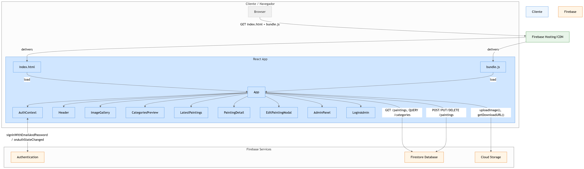

# DColors - Galería Virtual de Cuadros

<div align="center">
  
</div>

## 📋 Descripción del Proyecto

DColors es una galería virtual desarrollada para una empresa que se dedica a la venta de cuadros. Esta plataforma funciona como un catálogo digital que permite a la empresa exponer sus productos a las tiendas afiliadas, facilitando la actualización y visualización del inventario disponible sin necesidad de desplazamientos físicos.

La aplicación está construida con React y utiliza Firebase como backend para almacenar y gestionar la información de los cuadros, así como para la autenticación de administradores.

### Objetivo Principal
Crear un espacio digital donde los distribuidores y tiendas afiliadas puedan explorar la colección completa de cuadros disponibles, filtrar por categorías y obtener información detallada de cada pieza, además de proporcionar una herramienta de gestión para los administradores de la empresa.

## 🚀 Características Principales

- **Galería Responsive**: Diseño adaptable que funciona en dispositivos móviles, tablets y escritorio
- **Filtrado por Categorías**: Permite a los usuarios filtrar cuadros por temáticas
- **Panel de Administración**: Interfaz para gestionar los cuadros y categorías
- **Autenticación**: Sistema de login para acceder al panel de administración
- **Últimas Pinturas**: Sección que muestra las obras más recientes
- **Navegación Intuitiva**: Interfaz de usuario simple y efectiva

## 🛠️ Tecnologías Utilizadas

- **HTML5**: Estructura de la página
- **CSS3**: Estilos y diseño responsive
- **JavaScript**: Funcionalidades interactivas y dinámicas
- **React**: Biblioteca para construir la interfaz de usuario
- **Firebase**: Backend como servicio para almacenamiento y autenticación
- **Bootstrap**: Framework para el diseño responsive
- **Font Awesome**: Iconografía
- **Google Fonts**: Tipografías personalizadas

## 🖼️ Capturas de Pantalla

<div align="center">
  
  <p><em>Página principal</em></p>
</div>

<p align="center">Landing page de la web, donde destacan las últimas novedades añadidas</p>


<div align="center">
  
  <p><em>Sobre nosotros</em></p>
</div>

<p align="center">Apartado para conocer la empresa, su historia y recorrido</p>


<div align="center">
  
  <p><em>Categorías</em></p>
</div>

<p align="center">Carrusel con las diferentes categorías disponibles</p>


<div align="center">
  
  <p><em>Galería de cuadros</em></p>
</div>

<p align="center">Galería principal con sistema de filtrado para una visualización personalizada</p>


<div align="center">
  
  <p><em>Vista de características de un cuadro</em></p>
</div>

<p align="center">Ejemplo de vista detallada de un cuadro</p>


<div align="center">
  
  <p><em>Página de login para el administrador</em></p>
</div>

<p align="center">Página de login exclusiva para el administrador</p>


<div align="center">
  
  <p><em>Página de administración</em></p>
</div>

<p align="center">Apartado donde se gestiona la subida y modificación de cuadros</p>


<div align="center">
  
  <p><em>Página de edición para administrador</em></p>
</div>

<p align="center">Ventana modal disponible únicamente para el administrador, donde podrá modificar detalles del cuadro desde la galería</p>


## 📁 Estructura Principal del Proyecto

```
DColors/
│
├── src/                                # Código fuente del proyecto
│   ├── components/                     # Componentes reutilizables
│   │   ├── AdminPanel.js               # Panel de administración
│   │   ├── AuthContext.js              # Contexto de autenticación
│   │   ├── CategoriesPreview.js        # Vista previa de categorías
│   │   ├── EditPaintingModal.js        # Modal para editar pinturas
│   │   ├── Header.js                   # Componente de cabecera
│   │   ├── ImageGallery.js             # Galería de imágenes
│   │   ├── LatestPaintings.js          # Componente de pinturas recientes
│   │   ├── LoginAdmin.js               # Componente de login para administradores
│   │   └── PaintingDetail.js           # Detalle de pintura
│   │
│   ├── App.css                         # Estilos para el componente App
│   ├── App.js                          # Componente principal de la aplicación
│   ├── App.test.js                     # Tests para el componente App
│   ├── firebaseConfig.js               # Configuración de Firebase
│   ├── index.css                       # Estilos globales
│   ├── index.js                        # Punto de entrada de la aplicación
|
│── public/                             # Imágenes empleadas
    |─ screenshots                      # Capturas de pantalla de la web
```

## 📊 Diagrama del Proyecto

<div align="center">
  
  <p><em>GitDiagram</em></p>
</div>


## 🚀 Instalación y Uso

1. Clona este repositorio:
```bash
git clone https://github.com/lorena-murciab/DColors.git
```

2. Navega al directorio del proyecto:
```bash
cd DColors
```

3. Instala las dependencias:
```bash
npm install
```

4. Configura Firebase: 
  - Crea un proyecto en Firebase Console
  - Añade una aplicación web
  - Copia firebaseConfig.example.js a firebaseConfig.js
  - Actualiza el archivo con tus credenciales de Firebase

  IMPORTANTE: Nunca subas tu archivo firebaseConfig.js con credenciales reales al repositorio.


5. Inicia la aplicación en desarrollo:
```bash
npm start
```

6. Accede a la aplicación en tu navegador:
  http://localhost:3000


## 🔮 Planes Futuros

- Implementar sistema de autenticación para tiendas afiliadas
- Añadir funcionalidad de solicitud de pedidos directamente desde la plataforma
- Añadir más categorías y opciones de filtrado

## 👩‍💻 Desarrollado por

Lorena Murcia - Desarrolladora Web
- [LinkedIn](https://www.linkedin.com/in/tu-perfil/)
- [GitHub](https://github.com/lorena-murciab)

## 📄 Propiedad y Derechos

Este proyecto es propiedad de DColors y Lorena Murcia. El código y diseño están alojados en Hostinger y no están disponibles para su uso, redistribución o modificación sin permiso explícito.

<div align="center">
  <p>© 2025 DColors. Todos los derechos reservados.</p>
</div>