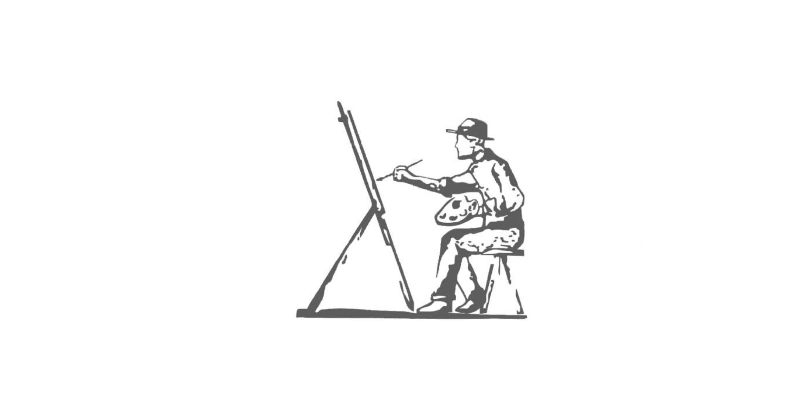
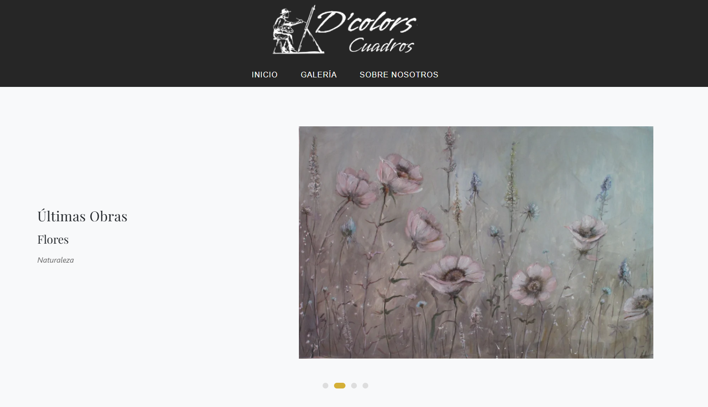
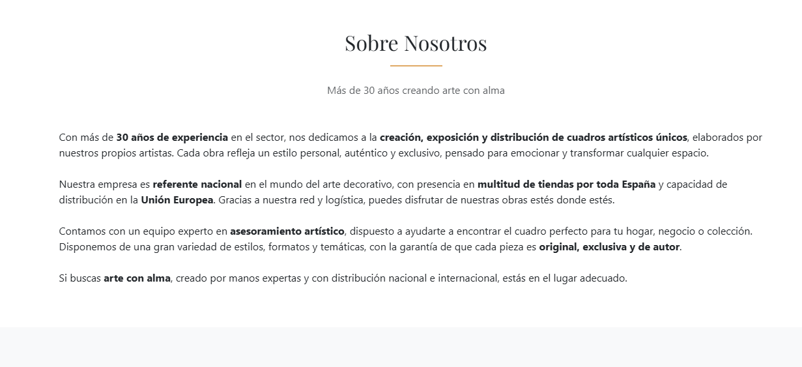
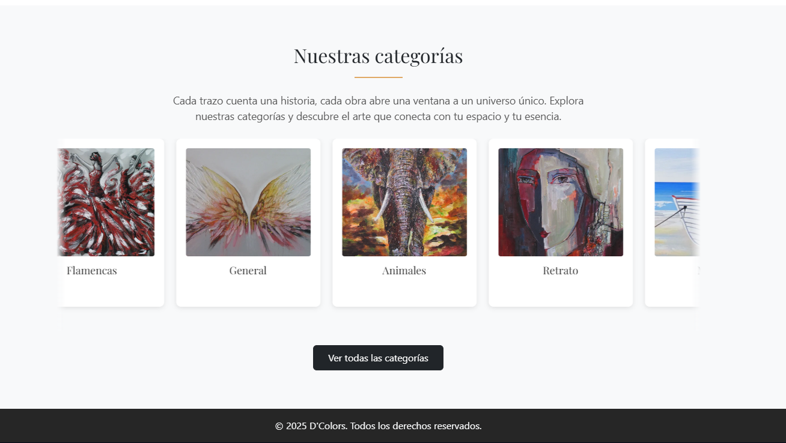
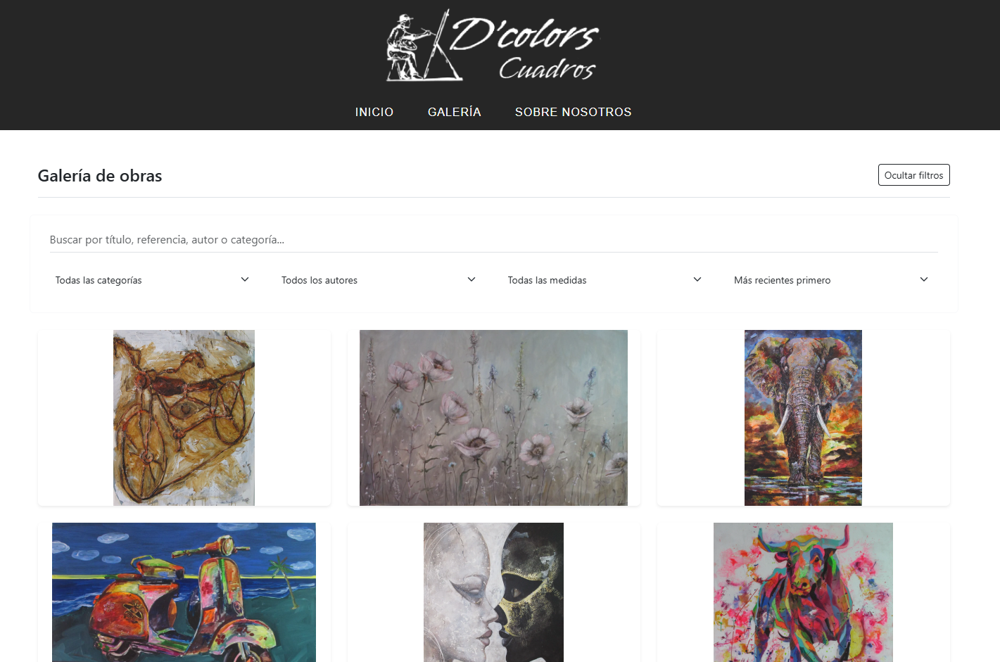
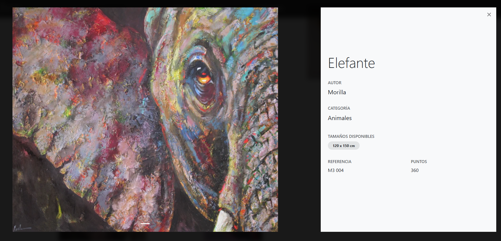
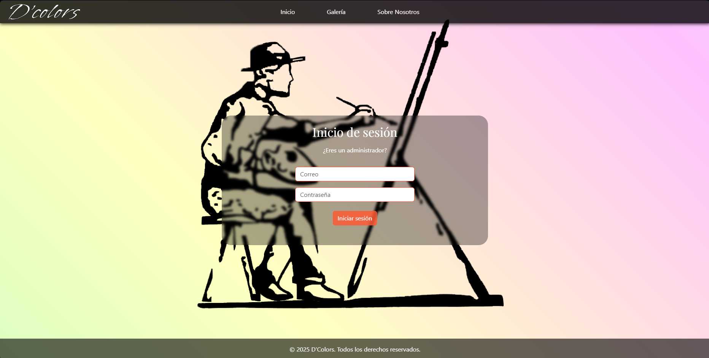
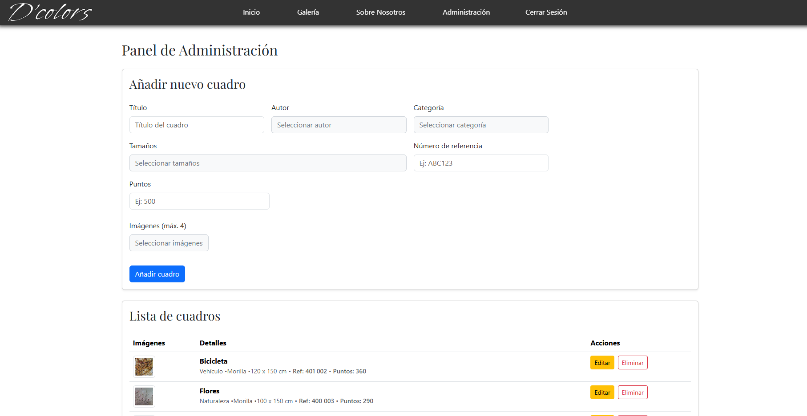
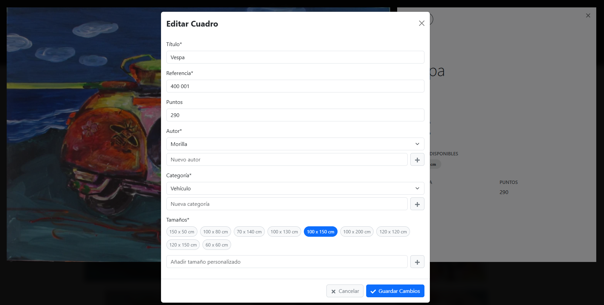

# DColors - Galería Virtual de Cuadros

<div align="center">
  
</div>

## 📋 Descripción del Proyecto

DColors es una galería virtual desarrollada para una empresa que se dedica a la venta de cuadros. Esta plataforma funciona como un catálogo digital que permite a la empresa exponer sus productos a las tiendas afiliadas, facilitando la actualización y visualización del inventario disponible sin necesidad de desplazamientos físicos.

### Objetivo Principal
Crear un espacio digital donde los distribuidores y tiendas afiliadas puedan explorar la colección completa de cuadros disponibles, filtrar por categorías y obtener información detallada de cada pieza.

## 🚀 Características Principales

- **Galería Responsive**: Diseño adaptable que funciona en dispositivos móviles, tablets y escritorio
- **Filtrado por Categorías**: Permite a los usuarios filtrar cuadros por temáticas
- **Visualización Detallada**: Cada cuadro cuenta con su propia página de detalles
- **Navegación Intuitiva**: Interfaz de usuario simple y efectiva
- **Gestión Administrativa**: Administración de cuadros disponibles a cargo del empresario.

## 🛠️ Tecnologías Utilizadas

- **HTML5**: Estructura de la página
- **CSS3**: Estilos y diseño responsive
- **JavaScript**: Funcionalidades interactivas y dinámicas
- **Bootstrap**: Framework para el diseño responsive
- **Font Awesome**: Iconografía
- **Google Fonts**: Tipografías personalizadas
- **Firebase**: Base de datos y autentificación

## 🖼️ Capturas de Pantalla

<div align="center">
  
  <p><em>Página principal</em></p>
</div>

<div align="center">
  
  <p><em>Sobre nosotros</em></p>
</div>

<div align="center">
  
  <p><em>Categorías</em></p>
</div>

<div align="center">
  
  <p><em>Galería de cuadros</em></p>
</div>

<div align="center">
  
  <p><em>Vista de características de un cuadro</em></p>
</div>

<div align="center">
  
  <p><em>Página de login para el administrador</em></p>
</div>

<div align="center">
  
  <p><em>Página de administración</em></p>
</div>

<div align="center">
  
  <p><em>Página de edición para administrador</em></p>
</div>

## 📁 Estructura del Proyecto

```
DColors/
│
├── index.html             # Página principal
├── cuadros.html           # Galería de cuadros
├── contacto.html          # Formulario de contacto
├── sobrenosotros.html     # Información de la empresa
│
├── css/                   # Archivos de estilos
│   ├── estilos.css        # Estilos generales
│   └── normalize.css      # Normalización de estilos
│
├── js/                    # Archivos JavaScript
│   └── script.js          # Funcionalidades interactivas
│
├── img/                   # Imágenes y recursos gráficos
│   ├── cuadros/           # Imágenes de los cuadros
│   ├── banner/            # Imágenes para banners
│   └── logooo.jpeg        # Logo de la empresa
│
└── screenshots/           # Capturas de pantalla para documentación
```

## 🚀 Instalación y Uso

1. Clona este repositorio:
```bash
git clone https://github.com/lorena-murciab/DColors.git
```

2. Abre el archivo `index.html` en tu navegador preferido.

3. Para ver la galería completa, navega a la sección "Cuadros" desde el menú principal.

## 🔮 Planes Futuros

- Implementar sistema de autenticación para tiendas afiliadas
- Añadir funcionalidad de solicitud de pedidos directamente desde la plataforma
- Añadir más categorías y opciones de filtrado

## 👩‍💻 Desarrollado por

Lorena Murcia - Desarrolladora Web
- [LinkedIn](https://www.linkedin.com/in/tu-perfil/)
- [GitHub](https://github.com/lorena-murciab)

## 📄 Licencia

Este proyecto está bajo la Licencia [MIT](https://opensource.org/licenses/MIT) - consulta el archivo LICENSE para más detalles.

---

<div align="center">
  <p>© 2025 DColors. Todos los derechos reservados.</p>
</div>

### `npm run build` fails to minify

This section has moved here: [https://facebook.github.io/create-react-app/docs/troubleshooting#npm-run-build-fails-to-minify](https://facebook.github.io/create-react-app/docs/troubleshooting#npm-run-build-fails-to-minify)
